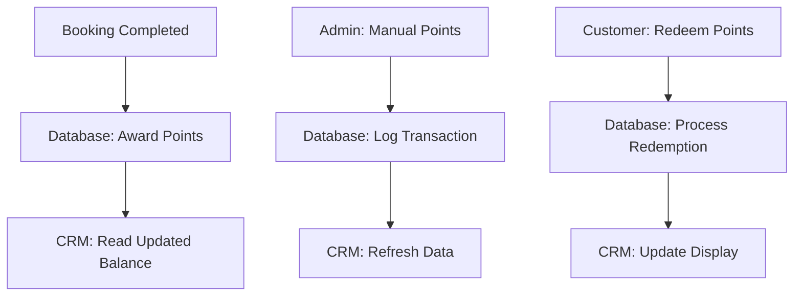

# 🔗 CRM Integration for Points System

## 🗄️ **Database-First Approach (Recommended)**

### Why Database First?
1. **Single Source of Truth**: All point data lives in your main database
2. **Real-time Accuracy**: CRM reads live data, no sync delays
3. **Easier Maintenance**: One system to update, one place for bugs
4. **Better Performance**: Direct queries instead of API calls
5. **Audit Trail**: Complete transaction history in one place

## 🔄 **Integration Architecture**



## 🎛️ **CRM Dashboard Features**

### Customer Points Overview
```typescript
// CRM Points Widget
const CustomerPointsWidget = {
  currentBalance: 12450,
  lifetimeEarned: 45600,
  lifetimeRedeemed: 28150,
  lifetimeExpired: 5000,
  
  // Quick Actions
  quickActions: [
    "Add Bonus Points",
    "Extend Expiration", 
    "View Transaction History",
    "Process Manual Redemption"
  ],
  
  // Expiration Alerts
  expiringPoints: {
    amount: 2500,
    expiryDate: "2024-12-15",
    daysLeft: 45
  }
}
```

### Points Management Interface
```typescript
// Admin can perform these actions in CRM
const CRM_POINTS_ACTIONS = {
  // Award points manually
  awardPoints: {
    amount: number,
    reason: string,
    expiryDate?: Date,
    notifyCustomer: boolean
  },
  
  // Deduct points
  deductPoints: {
    amount: number,
    reason: string,
    requireApproval: boolean
  },
  
  // Extend expiration
  extendExpiry: {
    pointBatchId: string,
    newExpiryDate: Date,
    reason: string
  },
  
  // Recover expired points
  recoverExpired: {
    transactionId: string,
    reason: string,
    newExpiryDate: Date
  }
}
```

## 📊 **CRM API Endpoints**

### Customer Points API
```typescript
// GET /api/crm/customers/{customerId}/points
interface CustomerPointsResponse {
  customerId: string;
  currentBalance: number;
  expiringBalance: number;  // Points expiring in next 30 days
  
  // Summary stats
  lifetimeEarned: number;
  lifetimeRedeemed: number;
  lifetimeExpired: number;
  
  // Recent activity
  recentTransactions: PointTransaction[];
  
  // Expiration schedule
  expirationSchedule: {
    amount: number;
    expiryDate: Date;
  }[];
}

// GET /api/crm/points/transactions
interface PointsTransactionQuery {
  customerId?: string;
  dateFrom?: Date;
  dateTo?: Date;
  type?: PointTransactionType;
  limit?: number;
  offset?: number;
}

// POST /api/crm/points/award
interface AwardPointsRequest {
  customerId: string;
  amount: number;
  reason: string;
  expiryDate?: Date;
  adminUserId: string;
  notifyCustomer: boolean;
}

// POST /api/crm/points/deduct
interface DeductPointsRequest {
  customerId: string;
  amount: number;
  reason: string;
  adminUserId: string;
  requireApproval?: boolean;
}
```

## 🚨 **CRM Alert System**

### Automated Alerts
```typescript
const CRM_ALERTS = {
  // Customer-specific alerts
  customerAlerts: [
    {
      type: "POINTS_EXPIRING",
      trigger: "30 days before expiry",
      action: "Show in customer profile + send notification",
      priority: "medium"
    },
    {
      type: "LARGE_REDEMPTION", 
      trigger: "> 10,000 points redeemed",
      action: "Flag for manager review",
      priority: "low"
    },
    {
      type: "NEGATIVE_BALANCE",
      trigger: "Points balance goes negative",
      action: "Immediate admin notification",
      priority: "high"
    }
  ],
  
  // System-wide alerts  
  systemAlerts: [
    {
      type: "HIGH_EXPIRATION_RATE",
      trigger: "> 20% points expiring monthly",
      action: "Business strategy review",
      priority: "medium"
    },
    {
      type: "LOW_REDEMPTION_RATE", 
      trigger: "< 5% redemption rate",
      action: "Points value adjustment needed",
      priority: "low"
    }
  ]
}
```

### CRM Notification Templates
```typescript
const CRM_NOTIFICATIONS = {
  pointsAwarded: {
    email: "🎉 {amount} bonus points awarded! Reason: {reason}",
    sms: "Bonus: +{amount} pts! Total: {balance} pts. Expires: {expiry}"
  },
  
  pointsExpiring: {
    email: "⏰ {amount} points expire in {days} days. Use them now!",
    sms: "{amount} pts expire {date}. Book now to extend: {bookingLink}"
  },
  
  pointsExpired: {
    email: "❌ {amount} points expired. Book a service to reactivate.",
    sms: "{amount} pts expired. Next booking extends all points!"
  }
}
```

## 📈 **CRM Analytics Dashboard**

### Points System KPIs
```typescript
const POINTS_ANALYTICS = {
  // Financial Impact
  pointsLiability: {
    totalOutstanding: 2450000,  // R24,500 in points
    monthlyGrowth: 12.5,        // 12.5% growth
    redemptionCost: 8500        // R85 redeemed this month
  },
  
  // Customer Behavior
  customerEngagement: {
    activePointsUsers: 1247,     // Users with points balance
    redemptionRate: 8.3,         // 8.3% monthly redemption
    expirationRate: 15.2,        // 15.2% monthly expiration
    averageBalance: 1965         // Average points per user
  },
  
  // Service Impact
  serviceImpact: {
    pointsInfluencedBookings: 234, // Bookings influenced by points
    averagePointsPerBooking: 145,  // Average points earned
    conversionRate: 23.4          // % bookings using points
  }
}
```

## 🛠️ **Implementation in CRM**

### Database Views for CRM
```sql
-- Create optimized views for CRM queries
CREATE VIEW crm_customer_points_summary AS
SELECT 
  u.id as customer_id,
  u.email,
  u.firstName,
  u.lastName,
  u.loyaltyPoints as current_balance,
  
  -- Lifetime stats
  COALESCE(SUM(CASE WHEN pt.points > 0 THEN pt.points ELSE 0 END), 0) as lifetime_earned,
  COALESCE(SUM(CASE WHEN pt.points < 0 THEN ABS(pt.points) ELSE 0 END), 0) as lifetime_redeemed,
  
  -- Expiring points (next 30 days)
  COALESCE(SUM(CASE 
    WHEN pt.expiresAt BETWEEN NOW() AND NOW() + INTERVAL '30 days' 
    AND pt.isExpired = false 
    THEN pt.points 
    ELSE 0 
  END), 0) as expiring_balance,
  
  -- Last activity
  MAX(pt.createdAt) as last_point_activity
  
FROM User u
LEFT JOIN PointTransaction pt ON u.id = pt.userId
GROUP BY u.id, u.email, u.firstName, u.lastName, u.loyaltyPoints;
```

### CRM Widget Components
```typescript
// React components for CRM integration
export const CustomerPointsWidget = ({ customerId }) => {
  const { data, loading } = useCustomerPoints(customerId);
  
  return (
    <div className="points-widget">
      <div className="balance-display">
        <h3>{data.currentBalance.toLocaleString()} Points</h3>
        <span>≈ R{(data.currentBalance / 100).toFixed(2)} value</span>
      </div>
      
      {data.expiringBalance > 0 && (
        <Alert type="warning">
          {data.expiringBalance} points expiring soon
        </Alert>
      )}
      
      <PointsActionButtons customerId={customerId} />
    </div>
  );
};

export const PointsTransactionHistory = ({ customerId }) => {
  return (
    <TransactionTable
      endpoint={`/api/crm/customers/${customerId}/points/transactions`}
      columns={['Date', 'Type', 'Points', 'Description', 'Balance']}
    />
  );
};
```

## 🔒 **Security & Permissions**

### Admin Role Permissions
```typescript
const POINTS_PERMISSIONS = {
  SUPPORT_AGENT: [
    "VIEW_POINTS",
    "VIEW_TRANSACTIONS",
    "AWARD_SMALL_BONUS"     // < 1000 points
  ],
  
  MANAGER: [
    "VIEW_POINTS", 
    "VIEW_TRANSACTIONS",
    "AWARD_POINTS",          // Any amount
    "DEDUCT_POINTS",         // < 5000 points
    "EXTEND_EXPIRY"
  ],
  
  ADMIN: [
    "ALL_POINTS_ACTIONS",
    "BULK_OPERATIONS",
    "RECOVER_EXPIRED",
    "SYSTEM_CONFIG"
  ]
}
```

This CRM integration gives you complete control over the points system while maintaining data integrity and providing excellent customer service capabilities.